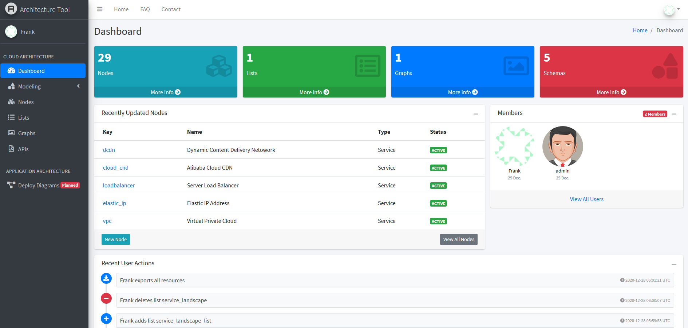
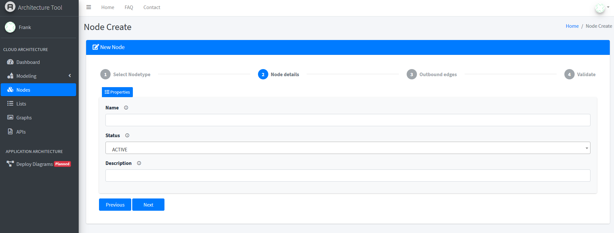
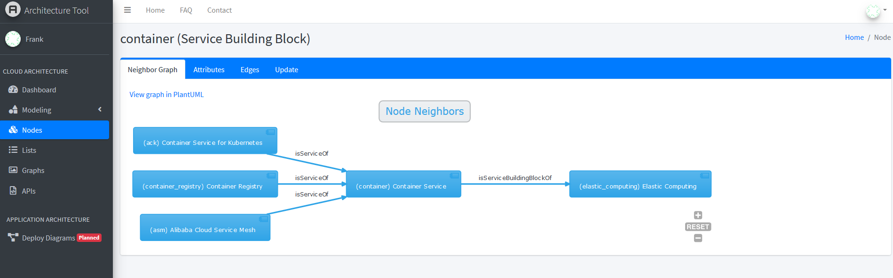

Architecture Tool
=================

.. image:: https://img.shields.io/badge/built%20with-Cookiecutter%20Django-ff69b4.svg
     :target: https://github.com/pydanny/cookiecutter-django/
     :alt: Built with Cookiecutter Django
.. image:: https://img.shields.io/badge/code%20style-black-000000.svg
     :target: https://github.com/ambv/black
     :alt: Black code style

:License: MIT

The architecture tool adopts "diagram as code" approach. Based on the JSON definition of all resources, it generates plain text to draws UML diagrams to model a complex cloud environment. It's especially useful and efficient to manage the drawings when over 20 nodes and relationships are involved.

The tool can be extended as a configuration and asset management tool and single source of truth for the real IT environment. Here are a few features that the tool can be extended to have.

* Update Confluence pages on node changes
* Update Jira tickets on node changes
* Trigger environment changes. (e.g. create permission groups in another software when the groups are added to the tool)
* Synchronize data from external resources (e.g. person data from ative directory)
* ...

Furthermore, it will provide some lightweight solutions for uses in the future to draw architecture diagrams for their applications in hybird cloud environments.

Functional Features
-------------------
* Sign in with Gitlab or local account
* A GUI to create/update all resources
* JSON schema to define node attributes and constrains
* Generates PlantUML diagrams to define graphical views of the system
* Synchronize data from upstream tools or resources
* Act as single source of truth by pushing data to downstream tools
* Background job to save data to Gitlab to keep track of node change history
* Background job to update document in Confluence whenever a node changes
* Zoom in/out of diagrams
* Export data as zipfile, import/restore data from another architecture tool instance

Technical Summary
-----------------
* Python 3.8, Django 3.0, PostgreSQL
* Django REST framework and Swagger UI for backend APIs
* AdminLTE template, Bootstrap 4
* Project initialized by cookiecutter-django
* Render HTML forms based on JSON schema definition
* OAuth2 authentication with Gitlab
* Asynchronous tasks using Celery and Redis
* Caching using Redis
* S3 compatible object storage - Minio
* Automated testing using pytest
* Deployment: Docker, Cloud Foundry
* Sphinx for documentation

Screenshots
-----------
Dashboard

Schema

Nodes

.. image:: media/nodes.png
  :width: 800

New node

Node details

Swagger UI for APIs

Settings
--------

Moved to settings_.

Also create .project file and add following additional settings.
::

  # OAuth2 with Gitlab
  GITLAB_URL=https://<gitlab-url>

  # Set REQUESTS_CA_BUNDLE only when the app needs connection to websites with self-signed certificates
  REQUESTS_CA_BUNDLE=/app/ca-certificates.crt

  # PlantUML
  PLANTUML_SERVER_URL=http://<host-ip>:8080

  # Architecture Tool
  ARCHITECTURE_TOOL_URL=http://<host-ip>:8000

  # Confluence (Set to true to enable confluence page update)
  SYNC_TO_CONFLUENCE=True
  # API Gateway for Confluence (Only required when SYNC_TO_CONFLUENCE is True)
  CONFLUENCE_URL=
  API_KEY=
  CONFLUENCE_USER=
  CONFLUENCE_PASS=

.. _settings: http://cookiecutter-django.readthedocs.io/en/latest/settings.html

Basic Commands
--------------

Setting Up Your Users
^^^^^^^^^^^^^^^^^^^^^

* To create an **superuser account**, use this command::

    $ python manage.py createsuperuser

Type checks
^^^^^^^^^^^

Running type checks with mypy:

::

  $ mypy architecture_tool_django

Test coverage
^^^^^^^^^^^^^

To run the tests, check your test coverage, and generate an HTML coverage report::

    $ coverage run -m pytest
    $ coverage html
    $ open htmlcov/index.html

Running tests with py.test
~~~~~~~~~~~~~~~~~~~~~~~~~~

::

  $ pytest

Live reloading and Sass CSS compilation
^^^^^^^^^^^^^^^^^^^^^^^^^^^^^^^^^^^^^^^

Moved to `Live reloading and SASS compilation`_.

.. _`Live reloading and SASS compilation`: http://cookiecutter-django.readthedocs.io/en/latest/live-reloading-and-sass-compilation.html

Celery
^^^^^^

This app comes with Celery.

To run a celery worker:

.. code-block:: bash

    cd architecture_tool_django
    celery -A config.celery_app worker -l info

Please note: For Celery's import magic to work, it is important *where* the celery commands are run. If you are in the same folder with *manage.py*, you should be right.

Email Server
^^^^^^^^^^^^

In development, it is often nice to be able to see emails that are being sent from your application. For that reason local SMTP server `MailHog`_ with a web interface is available as docker container.

Container mailhog will start automatically when you will run all docker containers.
Please check `cookiecutter-django Docker documentation`_ for more details how to start all containers.

With MailHog running, to view messages that are sent by your application, open your browser and go to ``http://127.0.0.1:8025``

.. _mailhog: https://github.com/mailhog/MailHog

Docker
^^^^^^

See detailed `cookiecutter-django Docker documentation`_.

.. _`cookiecutter-django Docker documentation`: http://cookiecutter-django.readthedocs.io/en/latest/deployment-with-docker.html

Gitlab Authentication
---------------------
Add application in Gitlab as per `GitLab as OAuth2 authentication service provider`_.

Perform steps as described in `django-allauth Post-Installation`_.

.. _`GitLab as OAuth2 authentication service provider`: https://docs.gitlab.com/ee/integration/oauth_provider.html
.. _`django-allauth Post-Installation`: https://django-allauth.readthedocs.io/en/latest/installation.html#post-installation

Access the tool
---------------

Please visit the various components of the tool via following URLs.

* Architecture Tool: http://<machine-ip>:8000
* Swagger UI for APIs: http://<machine-ip>:8000/swagger/
* Flower - Celery monitoring tool: http://<machine-ip>:5555
* PlantUML: http://<machine-ip>:8080
* Minio: http://<machine-ip>:9000
* Documentation: http://<machine-ip>:7000

Acknowledgments
---------------

* AdminLTE_
* django-dashboard-adminlte_
* django-adminlte3_

.. _AdminLTE: https://github.com/ColorlibHQ/AdminLTE
.. _django-adminlte3: https://github.com/d-demirci/django-adminlte3
.. _django-dashboard-adminlte: https://github.com/app-generator/django-dashboard-adminlte
